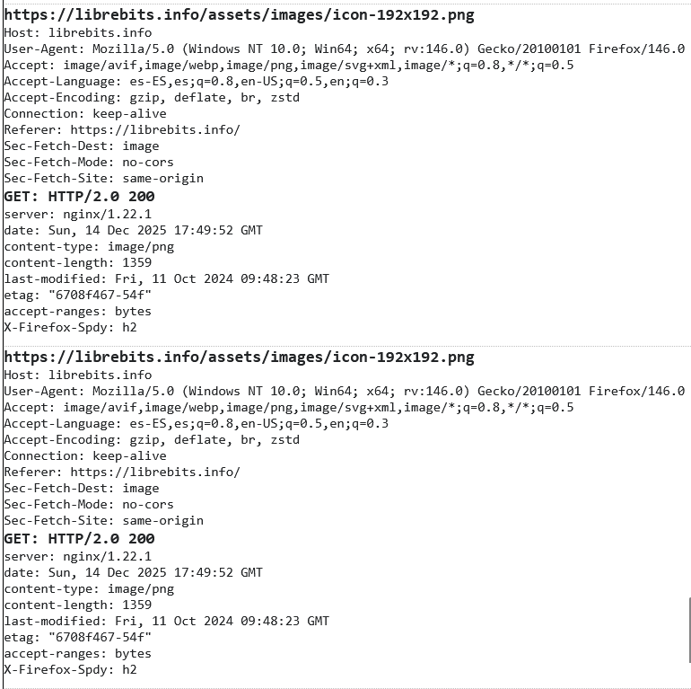
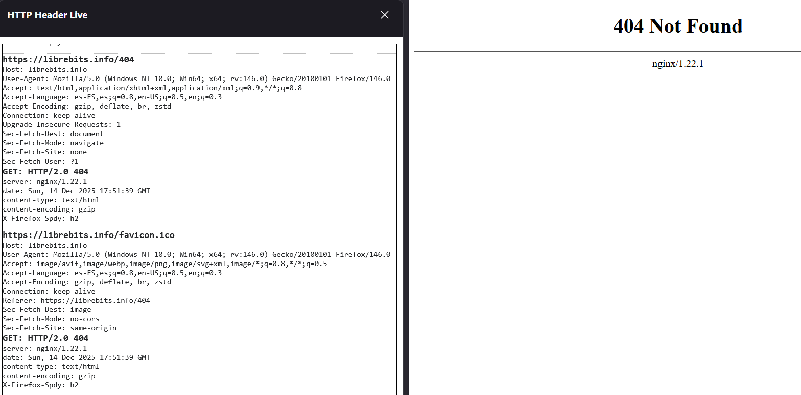
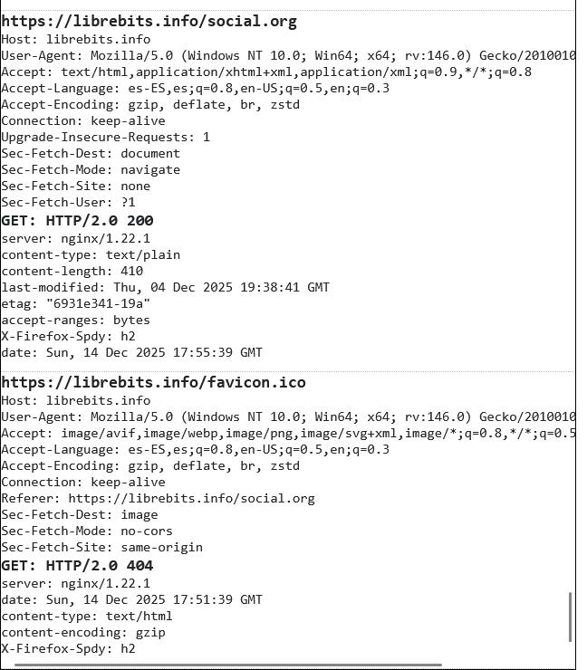
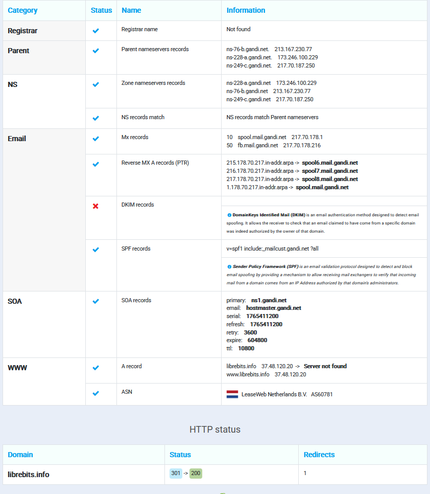
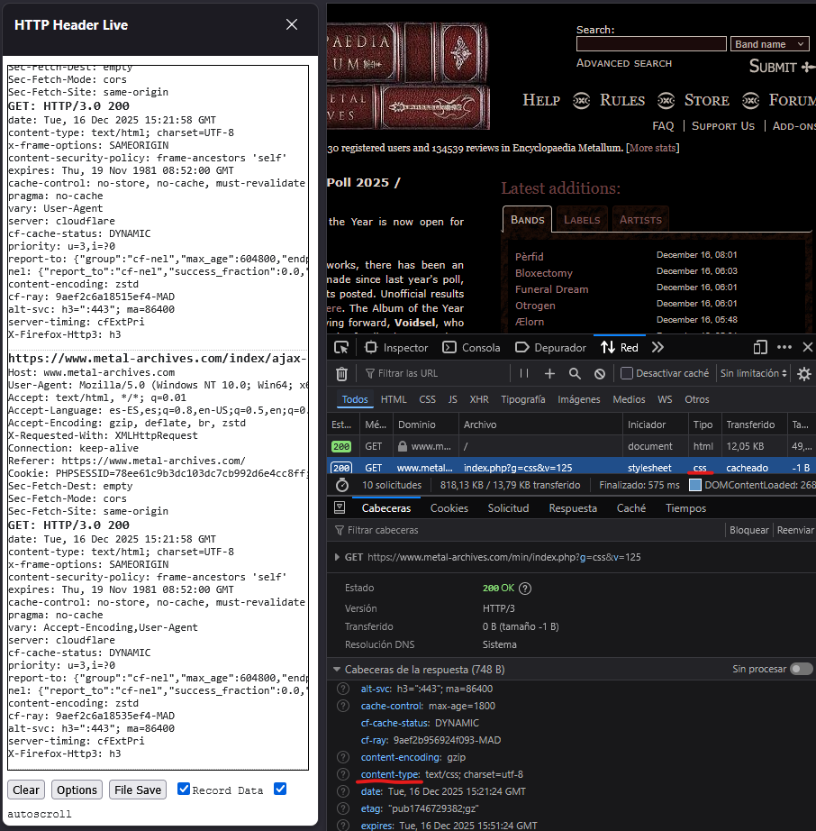
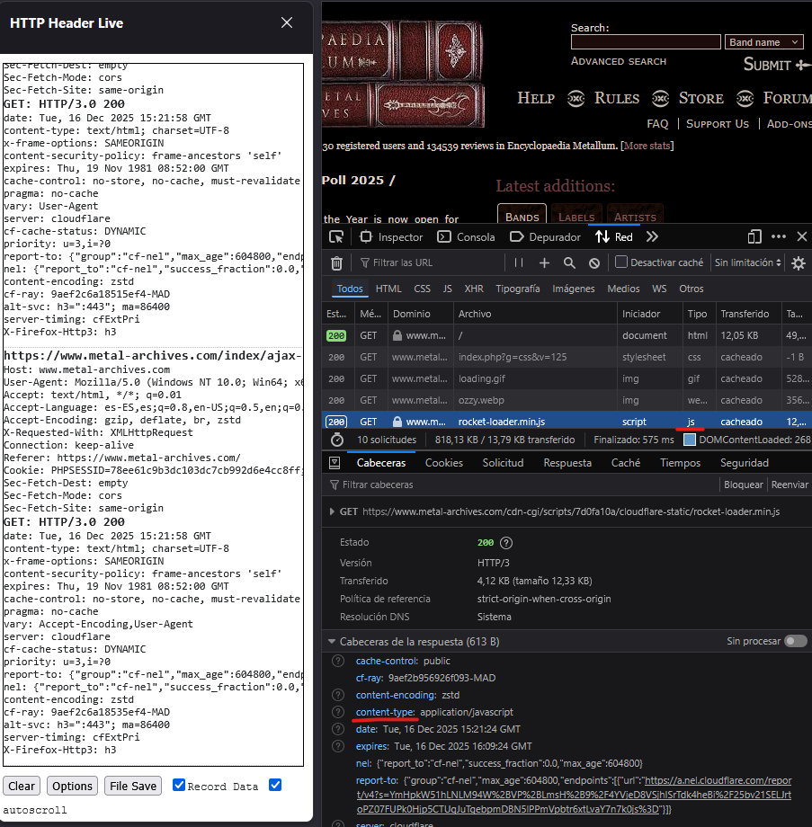

# Practica HTTP 

## 1.Instalación de las herramientas mozilla

Como se puede ver en la foto realizamos la instalacion de las herramientas de mozilla http a traves de la opcion de extensiones para el navegador.

## 2. Captura de peticiones HTTP

En este apartado navegaremos por 3 url ,las cuales nos daran 3 tipos distintos de codigos de petición.

1. https://librebits.info  
2. https://librebits.info/404 
3. https://librebits.info/social.org

Elementos a tener en cuenta: 
Host: Nos muestra a donde nos dirigimos, a donde vamos, en este caso veremos una ruta, qe si nos fijamos es la mismo quitando el http//.

User-Agent: Nos indica con que estamos accediendo y con que, en nuestro caso con el navegador Mozilla y con el S.O Windows.

Accept: Son los formatos que acepta esta pagina web, que los puede soportar, como vemos nos da unos cuantos.

Accept-Language: Nos indica tambien los lenguages soportados por esat we en este caso el primeor el español de España y el segundo el ingles de los EEUU

Connection: Indica el estado de la petición, como vemos sigue viva, si no pusira eso nos echaria de la web.

### 2.1 Codigo 200. (URL A)

Este codigo nos lo da la primera url, como se puede ver en la imagen de las herramientas de mozilla, hacemos una petición **GET**, ya que lo que queremos es acceder a algo, por lo que el servidor entendera que pedimos un recurso, en este caso el home de la pagina.

Tambien aparece la version HTTP que esta utilizando, y junto a el un numero, en este caso el **200**, que nos indica que no ha habido ningun error por parte del receptor ni por parte del servidor, ha ido todo perfecto.

Como podemos ver encontramos estas cabeceras:
* **Host**: El nombre de dominio al que se dirige la petición (`librebits.info`).
* **User-Agent**: Identifica el cliente que realiza la petición (Mozilla/Firefox en Windows 10).
* **Accept**: Especifica los tipos de contenido MIME que el cliente puede procesar (imágenes, webp, svg+xml, etc.).
* **Accept-Language**: Los idiomas preferidos por el usuario para la respuesta (español de España y luego inglés de EEUU).
* **Connection**: Indica que la conexión debe mantenerse abierta para futuras peticiones (**keep-alive**).
* **GET / HTTP/2.0**: Método de solicitud (`GET`), recurso solicitado (raíz `/` o home), y versión del protocolo (HTTP/2.0).

---

**Análisis de Respuesta HTTP (200 OK):**
En la captura de la petición a la URL A (https://librebits.info), se observa la respuesta del servidor para un recurso como la imagen del icono de la página, que también devuelve un código **200**.

* **Código de estado: 200 OK**: Significa que la petición ha tenido éxito. El recurso solicitado se ha encontrado y se devuelve al cliente.
* **Date**: La fecha y hora en que se originó la respuesta en el servidor.
* **Server**: El software del servidor web que respondió a la petición, en este caso `nginx/1.22.1`.
* **Content-Type**: Indica el tipo de medio del recurso que se está enviando, aquí es `image/png`.
* **Content-Length**: El tamaño en bytes del cuerpo de la entidad que se devuelve (el tamaño de la imagen).
* **last-modified / etag**: Cabeceras usadas para el **caching**, para verificar si el recurso ha cambiado desde la última vez que el cliente lo solicitó.

---

### 2.2 Código 404. (URL B)

Este codigo nos la da la segunda url, en esta como vemos no es un 200, y por lo que podemos ver en la web, esque hay algo que no funciona puesto que nos aparece un **404 Not Found**.

En esta peticion tambien requerimos de un **GET** pero ne este caso es un problemas del servidor puede ser o que la pagina ya no exista o otro posible error.

---

**Análisis de Respuesta HTTP (404 Not Found):**
En la captura de la petición a la URL B (https://librebits.info/404):

* **Código de estado: 404 Not Found**: Indica que el servidor no ha encontrado el recurso solicitado por el cliente. Es un error del lado del cliente (URL mal escrita o recurso inexistente).
* **Date**: La fecha y hora de la respuesta.
* **Server**: Nuevamente, el servidor es `nginx/1.22.1`.
* **Content-Type**: El contenido devuelto es `text/html`, que es la página de error 404.
* **Content-Length**: Aunque no está visible en la parte recortada de la captura, sería la longitud del cuerpo del mensaje HTML de error.

---

### 2.3 Código 301/200. (URL C)

Este código nos lo da la tercera url (`https://librebits.info/social.org`), y en este caso, la petición final al recurso de texto da un **200 OK**.

* **Petición GET /social.org HTTP/2.0**: El cliente solicita el recurso `/social.org`.
* **Respuesta 200 OK**: El recurso ha sido encontrado y devuelto correctamente.
* **Content-Type: text/plain**: Indica que el contenido devuelto es texto simple.

**Nota sobre redirección (301)**: Aunque la captura muestra un `200` para el recurso final de texto, a menudo una URL de este estilo puede provocar una redirección. Revisando el apartado 3, se ve que el dominio `librebits.info` realiza una redirección **301** hacia un **200** para acceder a la home. Un código **3xx** (como el 301) indica que el recurso solicitado se encuentra en otra ubicación, y el navegador debe hacer una nueva petición a la URL proporcionada en la cabecera `Location`.

---

### 3. HTPP y DNS

**Análisis de las Características DNS (Domain Name System) de librebits.info:**

El DNS Lookup (búsqueda de DNS) nos proporciona información vital sobre cómo se resuelve el nombre de dominio en la infraestructura de Internet.

* **Registrar / Parent Name Servers**: Muestra el registrador del dominio y los servidores de nombres principales (Parent NS), que son la primera parada para resolver el dominio.
* **NS Records (Name Servers)**: Lista los servidores de nombres autoritativos (`ns-76-b.gandi.net`, etc.) que guardan la configuración DNS del dominio.
* **Email (MX Records)**: Muestra los *Mail Exchanger* records (`spool.mail.gandi.net`), que indican a qué servidores se deben enviar los correos electrónicos dirigidos a `@librebits.info`.
* **SPF / DKIM**: Registros de seguridad para el correo electrónico. **SPF** define qué servidores están autorizados a enviar correo desde el dominio.
* **WWW (A Record)**: Este es el registro más importante. Muestra la dirección IP pública (`37.48.120.20`) a la que se traduce el nombre de dominio (`librebits.info`). Es la dirección del servidor web que aloja la página.
* **HTTP Status (301 -> 200)**: Muestra una redirección **301** (Movido Permanentemente) al acceder al dominio, indicando que el navegador fue dirigido a una nueva URL (típicamente de `http` a `https` o de `www` a sin `www`) antes de obtener la respuesta final **200 OK**.

---

### 4. Comparacion otros Recursos

#### CSS

**Petición y Respuesta CSS:**

En la captura de la petición de un archivo CSS:
* **Recurso solicitado**: `.../min/index.php?g=css&v=125`
* **Método/Versión**: `GET HTTP/200`
* **Content-Type de Respuesta**: `text/css; charset=utf-8`
    * **Significado**: Esta cabecera indica al navegador que el archivo recibido debe ser interpretado como una **hoja de estilos en cascada** (CSS), que define la apariencia visual de la página web.

---

#### JS

**Petición y Respuesta JS (JavaScript):**

En la captura de la petición de un archivo JavaScript:
* **Recurso solicitado**: `.../rocket-loader.min.js`
* **Método/Versión**: `GET HTTP/3 200` (Destaca el uso de HTTP/3, una versión más reciente del protocolo).
* **Content-Type de Respuesta**: `application/javascript`
    * **Significado**: Esta cabecera indica al navegador que el archivo recibido es un script de **JavaScript** ejecutable. El navegador lo cargará y lo ejecutará para añadir interactividad o modificar el contenido de la página.

---

**Diferencia de Content-Type entre Recursos:**

La cabecera **Content-Type** es esencial porque le dice al navegador exactamente qué tipo de archivo ha recibido y cómo debe procesarlo:

| Recurso (Ejemplo) | Content-Type de Respuesta | Significado |
| :--- | :--- | :--- |
| **Página Web (HTML)** | `text/html` | Es el contenido principal de la página. |
| **Hoja de Estilos (CSS)** | `text/css` | Archivo de estilos para dar formato a la página. |
| **Script (JavaScript)** | `application/javascript` | Código que el navegador debe ejecutar. |
| **Imagen (PNG)** | `image/png` | Archivo de imagen que debe mostrarse. |

Esta cabecera garantiza que el navegador aplique el motor de renderizado o el intérprete correcto para cada recurso.